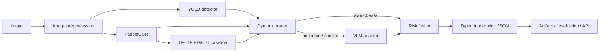

# VisionGuard

> 面向出版内容审核的多模态 AI/CV 研究工程。An industry-style multimodal moderation research pipeline for publishing content.

VisionGuard 将目标检测、OCR、文本基线、视觉语言模型（VLM）、动态路由与可解释风险融合组织成可训练、可评估、可回放、可服务化的完整链路。项目重点是算法工程流程和实验可信度，而不是用户、权限或 CRUD 系统。

## Why this project

出版图片中的风险可能来自视觉目标、印刷文字，也可能来自二者组合后的语义。单一模型难以同时兼顾成本、召回率与可解释性。VisionGuard 因此采用两阶段级联：先执行低成本视觉/OCR/文本分析，仅在证据冲突、置信度不足或语义复杂时调用 VLM，最后由独立融合层给出结构化结论。



## Key capabilities

- Configurable YOLO detection classes with training, validation, inference and standard detection metrics.
- Full-image and ROI PaddleOCR with polygon preservation, global-coordinate remapping and CER evaluation.
- TF-IDF + GBDT text baseline for a reproducible non-VLM comparison.
- Provider-neutral VLM interface with Pydantic contracts and bounded structured-output repair.
- Full and cascaded inference modes with explicit routing signals and `vlm_called` observability.
- Versioned, explainable risk fusion with evidence provenance, ablation and offline replay.
- Batch-size benchmarking, stage latency, throughput and GPU-memory profiling.
- Cross-stage failure taxonomy, hard-case datasets and regression replay.
- Single-load FastAPI service with warmup, bounded concurrency, timeouts and Prometheus metrics.

Current quality gate: **144 automated tests passed** on the verified Phase 13 environment. Real-model results remain separately labeled as small engineering validation or smoke evidence.

## Repository layout

```text
src/visionguard/
├── detection/       # YOLO adapter, schemas, visualization
├── training/        # dataset validation, train/evaluate orchestration
├── ocr/             # OCR provider, ROI geometry, CER, visualization
├── baseline/        # TF-IDF + GBDT training and inference
├── vlm/             # provider contract, prompt/context, structured parsing
├── pipeline/        # full multimodal orchestration and artifacts
├── routing/         # cascaded decision policy and evaluation
├── fusion/          # evidence normalization and risk decision
├── benchmarking/    # latency, throughput and resource profiling
├── error_analysis/  # attribution, taxonomy and regression cases
└── api/             # inference-only FastAPI application
configs/             # reviewed public defaults; local overrides are ignored
scripts/             # train, infer, evaluate, benchmark and analysis CLIs
tests/               # unit and contract tests; real models use smoke scripts
docs/                # architecture, experiments, reproduction and interview material
data/                # tiny synthetic public fixtures only
```

## Module workflows

| Area | Main entry points | Output |
|---|---|---|
| Detection training/evaluation | `train_detector.py`, `evaluate_detector.py` | checkpoints, P/R/mAP, visual errors |
| OCR | `infer_ocr.py`, `infer_ocr_roi.py`, `evaluate_ocr.py` | text, confidence, polygon/bbox, CER |
| Text baseline | `train_text_baseline.py`, `evaluate_text_baseline.py` | persisted TF-IDF+GBDT, P/R/F1 |
| VLM review | `infer_vlm.py`, `evaluate_vlm.py` | validated moderation JSON and retry metadata |
| Full/cascaded pipeline | `run_pipeline.py`, `run_cascaded_pipeline.py` | final result, module statuses and timing |
| Routing/fusion | evaluation, sweep, ablation and replay scripts | call-rate, safety and decision comparisons |
| Benchmark/error analysis | benchmark and analyzer scripts | CSV/JSON reports, taxonomy and hard cases |
| Serving | `run_api.py`, `smoke_test_api.py` | single/batch HTTP inference and metrics |

Detailed commands and parameters live in the [CLI reference](docs/cli_reference.md), not in this front page.

## Quick start

Python 3.10+ is required. A CUDA-capable environment is recommended for real VLM inference. Install a PyTorch build that matches the host driver first, then install this project:

```bash
python -m venv .venv
# Windows: .venv\Scripts\activate
# Linux/macOS: source .venv/bin/activate
python -m pip install --upgrade pip
python -m pip install -e ".[dev]"
```

Run deterministic unit tests without loading large models:

```bash
pytest
```

Validate the VLM contract with the lightweight mock provider:

```bash
python scripts/infer_vlm.py --image data/vlm_eval/risky.png --mock
```

For real end-to-end inference, place your detector checkpoint outside Git, copy the public configs to ignored local overrides, update model paths, and run:

```bash
cp configs/detector.yaml configs/local_detector.yaml
cp configs/vlm.yaml configs/local_vlm.yaml
python scripts/run_cascaded_pipeline.py \
  --image data/vlm_eval/risky.png \
  --detector-config configs/local_detector.yaml \
  --vlm-config configs/local_vlm.yaml
```

Start the inference service after creating `configs/api.local.yaml` from `configs/api.yaml`:

```bash
python scripts/run_api.py --config configs/api.local.yaml
```

See [reproducibility](docs/reproducibility.md), [configuration](docs/configuration.md) and the [CLI reference](docs/cli_reference.md) for the complete workflow.

## Structured result contract

Internal stages exchange Pydantic models rather than free-form text. The final result includes risk, categories, confidence, review requirement and traceable evidence:

```json
{
  "risk_level": "high",
  "categories": ["sensitive_text"],
  "reason": "OCR and VLM evidence agree on policy-sensitive content.",
  "confidence_score": 0.91,
  "requires_manual_review": false
}
```

The VLM output is treated as untrusted input: it is parsed, normalized, validated and rejected or repaired within bounded retries before entering fusion.

## Experiment snapshot

The repository distinguishes engineering smoke checks from quality evidence. The included datasets are synthetic and deliberately tiny; the numbers below demonstrate that the pipeline is measurable, not that it is production-accurate.

| Component | Result | Evidence level | Interpretation |
|---|---:|---|---|
| YOLO smoke test | test mAP@0.5 `0.0603`; mAP@0.5:0.95 `0.0498` | Smoke, 2 test images | End-to-end train/eval path works; model quality is intentionally poor. |
| OCR | CER `0.0` | Smoke, 1 synthetic image | OCR evaluation path works; not a language benchmark. |
| Text baseline | validation F1 `0.8571` | Small engineering experiment, 8 validation texts | Useful comparison baseline; synthetic split is too small for generalization claims. |
| VLM structured output | success rate `100%` | Smoke, 3 images | Schema path worked; mean latency was `6.61 s` on the recorded machine. |
| Cascaded routing | VLM calls `100% → 66.7%`; mean latency `20.13 s → 13.05 s` | Small engineering experiment, 3 images | A `35.2%` observed mean-latency reduction, with no unsafe fast pass in this tiny set. |
| Risk fusion | risk accuracy/category F1 `1.0/1.0` | Small engineering experiment, 3 images | Confirms evaluation and ablation mechanics only. |

Phase 10 performance profiling used one measured run over two samples. VLM occupied about `91.2%` of full-pipeline latency; cascaded mode called VLM for both samples and was `1.0%` slower, so it showed no speedup in that run. This is intentionally reported separately from the Phase 8 routing experiment.

Full provenance, sample counts, configurations and caveats are in [Experiments](docs/experiments.md) and the [Final experiment summary](docs/final_experiment_summary.md).

## Routing and fusion boundaries

Routing answers **whether expensive semantic inference is needed**; fusion answers **what the final risk decision should be**. Keeping them separate enables:

- conservative fast-path safety constraints;
- threshold sweeps without changing fusion semantics;
- fusion replay and ablation without rerunning models;
- independent error attribution for detection, OCR, routing, VLM and decision logic.

The main trade-offs are documented in [Design decisions](docs/design_decisions.md).

## Evaluation and error analysis

Evaluation covers detector precision/recall/mAP, OCR CER, text precision/recall/F1, VLM structural success, routing call rate and unsafe-fast-pass rate, fusion accuracy/category F1, and latency/throughput/memory.

The unified error analyzer maps failures into 84 typed failure codes under nine top-level stages. It exports JSONL records, visual evidence, verified hard cases and regression candidates. In the recorded Phase 11 validation, three ground-truth samples produced two diagnostic cases, two hard cases and one eligible regression candidate; this validates the workflow, not failure prevalence.

## API surface

The service is inference-only:

- `POST /predict`
- `POST /predict/batch`
- `GET /health`
- `GET /metrics`

Models are created once during application lifespan and warmed before readiness. The service deliberately avoids authentication, user management and databases; those are deployment concerns outside this AI/CV portfolio scope. Real single-GPU execution uses one process because multiple workers duplicate model memory.

## Engineering principles

- Provider adapters isolate Ultralytics, PaddleOCR and local VLM implementation details.
- Pydantic schemas form stable boundaries between independently testable stages.
- Configuration controls model paths, thresholds, policies and artifact locations.
- Saved intermediate records support replay, ablation and regression without needless GPU work.
- Artifact manifests capture provenance while weights, private data and machine-local overrides stay out of Git.
- Unit tests mock heavyweight providers; explicit smoke commands validate real model integration.

## Tech stack

Python, PyTorch, Ultralytics YOLO, OpenCV, PaddleOCR/PaddlePaddle, scikit-learn, Transformers with Qwen3-VL, Pydantic, FastAPI/Uvicorn and pytest. Only technologies exercised by the repository are listed.

## Known limitations

1. Public fixtures are synthetic; there is no large, independently annotated publishing benchmark.
2. The smoke detector is not a usable moderation model, and current quality metrics do not establish generalization.
3. OCR execution and local VLM generation are sequential in the measured pipeline; layout reading order is basic.
4. Local VLM latency is high and depends strongly on GPU, precision, image size and token length.
5. `risk_score` is an engineering score, not a calibrated probability.
6. Routing is rule-based and was observed on only three labeled examples.
7. Fusion is rule/weight based rather than learned or calibrated on representative data.
8. The HTTP timeout cannot hard-cancel an already running CUDA/model call.
9. The default service uses one GPU and one full-inference concurrency slot.
10. Benchmark percentiles from one measured run are smoke signals, not stable estimates.
11. Authentication, rate limiting, persistent audit storage and production governance are out of scope.
12. There is no distributed deployment, external queue or multi-GPU scheduler; third-party licenses need separate review.

## Roadmap

- Curate a larger rights-cleared engineering evaluation set and strengthen OCR/layout evaluation.
- Calibrate scores and thresholds; consider learned routing/fusion only after enough labeled data exists.
- Evaluate VLM batching, compression, quantization and serving optimization such as TensorRT where compatible.
- Run repeated batch-size 1/4/8/16 benchmarks with controlled warmup and power state.
- Expand category-specific hard cases, regression gates and drift monitoring.
- Add distributed scheduling, authentication, rate limiting and audit retention only for a concrete deployment.

## Documentation

- [Architecture](docs/architecture.md)
- [Design decisions](docs/design_decisions.md)
- [Experiments](docs/experiments.md)
- [Final experiment summary](docs/final_experiment_summary.md)
- [Reproducibility](docs/reproducibility.md)
- [Configuration](docs/configuration.md)
- [CLI reference](docs/cli_reference.md)
- [Project report](docs/project_report.md)
- [Technical review](docs/visionguard_technical_review.md)
- [Resume wording](docs/resume_project.md)

## License

Project source code is released under the [MIT License](LICENSE). Model weights and datasets retain their own licenses and are not redistributed here.
