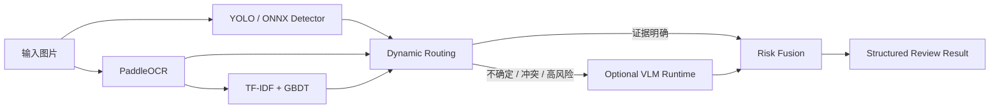

# VisionGuard

> 基于视觉语言模型的多模态出版内容智能审校系统<br>
> Multimodal Publishing Content Moderation System Based on Vision-Language Models

VisionGuard 是一个面向 AI / Computer Vision 算法作品集的本地优先项目。它把目标检测、OCR、传统文本分类、动态路由、视觉语言模型和风险融合组织为可评估、可解释、可服务化的完整推理链路。

> 当前处于 **v1.0 Release Candidate 准备阶段**。仓库尚未提供可公开下载的正式安装包，也未发布 `v1.0.0-rc.1` Tag。本地构建产物不能直接当作公开 Release 上传。

## 给使用者

### 它能做什么

- Fast Review：使用 CPU Core 完成目标检测、OCR、文本基线、路由和风险融合。
- Deep Review：安装可选 Advanced AI 后，按需调用本地 VLM 处理复杂语义或冲突证据。
- 全程本地：推理不依赖云端 API；运行时使用动态本地端口和会话令牌。
- 结构化结果：输出风险等级、类别、证据、置信度、人工复核建议和阶段耗时。

### 计划中的安装体验

1. 下载并校验 `VisionGuard-Setup-<version>.exe`。
2. 安装后从桌面快捷方式或开始菜单启动。
3. 内置 Slim CPU Core 直接进入 Ready，Fast Review 可立即使用。
4. 如需 Deep Review，在应用内选择 `advanced-ai-manifest.json`。
5. VisionGuard 自动验证所有分卷、检查磁盘空间、安装并激活 VLM Runtime 与 Models。

用户不需要安装 Python、Conda、Node、Rust，也不需要手工合并分卷或启动 FastAPI。

### Core 与 Advanced AI

| 组件 | 是否必需 | 当前实测体积 | 作用 |
|---|---:|---:|---|
| Slim Core Runtime | 是 | 约 0.697 GiB | ONNX Detector、PaddleOCR、Baseline、Routing、Fusion |
| Core Models | 是 | 约 0.146 GiB | Core 离线模型资产 |
| VLM Runtime | 否 | 约 4.216 GiB | PyTorch、Transformers、CUDA 侧运行环境 |
| VLM Models | 否 | 约 3.974 GiB | Qwen3-VL-2B-Instruct 模型资产 |

Core-only 安装体积约 0.843 GiB。Advanced AI 采用独立分卷、SHA-256 校验和原子激活，不会因为 VLM 故障影响 Fast Review。

### 系统要求

- 目标平台：64 位 Windows。
- Core：CPU 模式，仍需在更多机器上完成最低内存和性能测量。
- Advanced AI：当前仅在 RTX 4060 Laptop 8 GiB 环境完成开发验证。
- **RTX 4060 8 GiB 是已验证配置，不是最低配置。最低 GPU / VRAM 要求尚未充分刻画。**
- 磁盘：安装界面会依据实际包体和 staging 空间给出预检结果。

### 离线与隐私

Core 和已安装的 Advanced AI 均设计为断网可用。模型、日志、缓存与审核产物位于本机应用数据目录。发行验收仍需在没有开发工具和模型缓存的干净 Windows 环境中完成。

### 当前限制

- 尚未完成 clean-machine 全流程人工验收。
- Windows 安装包当前计划为 unsigned RC，可能触发 SmartScreen 提示。
- Detector 权重的公开再分发路径仍未解决。
- VLM Runtime 中 CUDA / PyTorch 原生二进制仍需按最终文件清单完成再分发复核。
- 暂不提供网络自动下载器；Advanced AI 第一版使用本地 manifest 导入。

发布状态与阻断项见 [Release Gate](docs/release_gate.md)，硬件实测见 [Hardware Compatibility](docs/hardware_compatibility.md)。

## 给开发者

### 系统架构



桌面发行采用独立组件边界：

```text
VisionGuard Desktop
├── bundled Slim CPU Core
│   ├── Core Runtime
│   └── Core Models
└── optional Advanced AI
    ├── VLM Runtime parts
    └── VLM Model parts
```

详细设计见 [架构说明](docs/architecture.md)、[组件化 Runtime](docs/componentized_runtime.md) 和 [Desktop 架构](docs/desktop_architecture.md)。

### 目录

```text
src/visionguard/       Python 算法、Pipeline、评估与 API
desktop/               Tauri + React 桌面应用
configs/               可版本化配置
scripts/               训练、评估、构建、验收工具
packaging/             Runtime 与组件发行配置
tests/                 Python 单元与集成测试
docs/                  架构、实验、发行和验收记录
artifacts/              本地实验产物（不提交）
models/                 本地模型包（不提交）
```

### 源码环境

```powershell
conda activate visionguard
pip install -e ".[dev]"
cd desktop
npm ci
```

训练、VLM 和发行 Runtime 使用不同依赖边界。Core 发行依赖位于 `requirements-runtime-core.txt`，Advanced AI 依赖位于 `requirements-runtime-vlm.txt`。

### 本地运行

外部 Backend 调试：

```powershell
python scripts/run_api.py --config configs/api.local.yaml
cd desktop
$env:VISIONGUARD_BACKEND_MODE="external"
$env:VISIONGUARD_API_URL="http://127.0.0.1:8000"
npm run tauri:dev
```

组件化 Sidecar 调试：

```powershell
python scripts/build_model_bundle.py --profile core --bundle-version core-models-v1 --output models/core-models-v1 --hardlink --force
python scripts/build_runtime.py --profile core --stage-tauri
cd desktop
npm run tauri:dev
```

### 构建 Advanced AI 分卷

```powershell
python scripts/build_model_bundle.py --profile vlm --bundle-version vlm-models-v1 --output models/vlm-models-v1 --hardlink --force
python scripts/build_runtime.py --profile vlm
python scripts/build_advanced_ai_package.py `
  --runtime runtime-dist-vlm/visionguard-vlm-runtime `
  --models models/vlm-models-v1 `
  --runtime-version 0.1.0 `
  --model-version vlm-models-v1 `
  --version advanced-ai-v1 `
  --part-size-mib 1024 `
  --output artifacts/advanced-ai-package
```

生成结果包含 `advanced-ai-manifest.json` 和有序 `.partNN` 文件。桌面安装器会先 fail-closed 校验文件名、顺序、大小、单卷 SHA-256 和组合归档 SHA-256，再跨分卷流式解压到 staging，最后原子切换 `components.json`。

### SBOM

```powershell
python scripts/generate_sbom.py --version 1.0.0-rc.1 --output artifacts/sbom
```

会生成 Desktop、Core Runtime 和 VLM Runtime 三份 CycloneDX 1.6 JSON。Python 清单来自发行 profile，不读取开发环境的 `pip freeze`。

### 质量门

```powershell
pytest -q
ruff check .
ruff format --check .
python -m compileall src scripts

cd desktop
npm test
npm run lint
npx tsc -b
npm run build

cd src-tauri
cargo test
cargo fmt --check
cargo check
```

### Release Candidate 构建

最终目标命令是：

```powershell
python scripts/build_release.py --version 1.0.0-rc.1
python scripts/validate_release.py --rc
```

只有 RC validator、clean-machine、离线、升级、卸载、历史回归和许可证分发门全部通过，才允许建议创建 `v1.0.0-rc.1`。构建成功本身不等于允许 Tag 或 Release。

### 许可证

VisionGuard 自有代码使用 MIT License。第三方代码、Runtime 和模型继续适用各自许可证；仓库 MIT License 不会改变第三方资产的许可。详见 [Third-Party Notices](THIRD_PARTY_NOTICES.md) 与 [模型分发审计](docs/model_distribution_licenses.md)。
