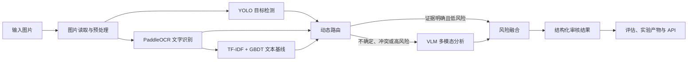

# VisionGuard

> 基于视觉语言模型的多模态出版内容智能审校系统
> Multimodal Publishing Content Moderation System Based on Vision-Language Models

## 下载与安装（组件化 Windows 候选架构）

VisionGuard 的目标用户不需要安装 Python、Conda、Node、Rust，也不需要手动启动 FastAPI。正式分发流程是：

1. 下载 Windows 安装器、必需的 Core Runtime 与 Core Models；
2. 校验 `SHA256SUMS.txt`；
3. 双击安装器，通过 Start Menu 或桌面快捷方式启动；
4. 首次启动时安装 Core Runtime 和 `core-models-v1`；
5. 如需深度审核，再安装可选的 VLM Runtime 与 `vlm-models-v1` Advanced AI Pack；
6. 等待本机完成兼容性、磁盘空间和 SHA-256 校验，显示 Ready 后选择图片审核。

**目前尚未发布可下载的公开安装包。** Slim CPU Core 是发行基线：Core Runtime 约 `0.697 GiB`，Core Models 约 `0.146 GiB`，无需 VLM 也能启动和执行 Fast Review。Advanced AI 是独立可选组件，其约 `3.974 GiB` 的模型资产仍受托管、许可与干净机验收门禁约束。请勿把本地产物上传为正式 Release。

当前目标平台为 Windows x86_64。Core 使用 CPU ONNX Detector 与 PaddleOCR；可选 VLM 仍优先使用 NVIDIA GPU。RTX 4060 Laptop 8 GiB 是开发验证环境，不是最低配置。组件边界见[组件化 Runtime 架构](docs/componentized_runtime.md)，旧单体方案见[Legacy Full Runtime](docs/legacy_full_runtime.md)。

Core-only 安装实测约 `0.843 GiB`。Advanced AI 的独立 Runtime 体积、完整安装峰值和最低 VRAM 仍需以打包与干净机实测为准，不在 README 中用估算值冒充结果。

## Desktop Application（本地 AI Runtime）

VisionGuard 提供基于 Tauri v2、React 和 TypeScript 的原生桌面工作台。它支持系统文件选择器、拖放图片、本地预览、快速/深度审核，以及 Detection、OCR、VLM、Routing、Fusion 和耗时证据视图。桌面端可以自动启动 PyInstaller 打包的 Python Runtime、等待模型就绪、动态注入本机端点，并在退出时回收进程。Phase 16 增加了轻量 NSIS 按用户安装、单实例、首次 Runtime/模型导入与发布候选校验。

### 组件化 Sidecar 开发模式

先构建独立模型包与 Runtime，随后桌面应用会自行管理后端，无需手动运行 FastAPI：

```powershell
python scripts/build_model_bundle.py --profile core --bundle-version core-models-v1 --output models/core-models-v1 --hardlink --force
python scripts/build_runtime.py --profile core --stage-tauri
# 可选 Advanced AI
python scripts/build_model_bundle.py --profile vlm --bundle-version vlm-models-v1 --output models/vlm-models-v1 --hardlink --force
python scripts/build_runtime.py --profile vlm
cd desktop
npm run tauri:dev
```

模型真实权重、生成的 Runtime 和运行日志均由 Git 忽略。`build_runtime.py` 默认构建 Core；旧 Full Runtime 必须显式使用 `--profile full`，且仅用于回归参考。

### 构建 Windows Release Candidate

在已准备好本地模型与打包环境的 Windows 开发机上运行：

```powershell
python scripts/build_release.py --version 0.1.0-rc.1
python scripts/validate_release.py release/v0.1.0-rc.1
```

`--public` 是更严格的公开发布门禁；当前因为许可和人工验收事项未解除，预期不会通过：

```powershell
python scripts/validate_release.py release/v0.1.0-rc.1 --public
```

干净机安装、GUI、卸载、重装与升级请逐项执行[Windows 发布验收清单](docs/release_acceptance_checklist.md)。

### External Backend 开发模式

需要单独调试 Python API 时，可以保留原有方式：

```powershell
# 终端 1：仓库根目录
python scripts/run_api.py --config configs/api.local.yaml

# 终端 2
cd desktop
$env:VISIONGUARD_BACKEND_MODE="external"
$env:VISIONGUARD_API_URL="http://127.0.0.1:8000"
npm install
npm run tauri:dev
```

浏览器前端预览可使用 `npm run dev`，但原生文件对话框、系统拖放和 Sidecar 生命周期需要 `npm run tauri:dev`。完整设计见 [Desktop 架构说明](docs/desktop_architecture.md)。

VisionGuard 是一个面向 AI / Computer Vision 算法实习作品集的研究型项目。它把目标检测、OCR 文字识别、传统文本分类、视觉语言模型（VLM）、动态路由和风险融合组织成一条完整、可评估、可复现的推理链路。

项目重点是展示工业界常见的算法研发过程，而不是开发用户系统、权限管理、数据库或复杂后台页面。

当前自动化测试规模：**Python 155 个、Desktop 前端 39 个、Rust 19 个**。Rust 测试除 Runtime 生命周期外，还覆盖模型/Runtime 包的路径安全、完整哈希校验与活动版本指针。仓库中的公开样本均为小规模合成数据；实验数字用于证明工程链路可运行，不能代表真实生产审核准确率。

## 项目要解决什么问题

一张出版图片可能同时包含多种风险：

- 图片里出现武器、暴力、血液、敏感符号等视觉内容；
- 图片中印刷了违规或敏感文字；
- 图片本身和文字单独看都正常，但组合起来存在特殊含义；
- OCR、检测器和语义模型给出了互相冲突的判断。

单一模型很难同时解决这些问题。因此 VisionGuard 采用两阶段级联推理：先运行成本较低的 YOLO、OCR 和文本基线；只有在证据不足、判断冲突或语义复杂时，才调用耗时更高的 VLM；最后由独立的风险融合模块生成结构化审核结论。

## 系统架构



更完整的系统图、Routing 图、Fusion 图和实验流程图见[架构说明](docs/architecture.md)。

## 核心能力

- **目标检测：**封装 Ultralytics YOLO，支持训练、验证、推理、可视化和 Precision、Recall、mAP 指标。
- **OCR：**支持整图 OCR 和 ROI OCR，保留倾斜文字 polygon，并把 ROI 坐标映射回原图。
- **传统文本基线：**使用 TF-IDF + GBDT，为 VLM 方法提供低成本对照实验。
- **VLM Adapter：**业务代码不绑定具体模型，输出通过 Pydantic 校验为严格结构化结果。
- **级联推理：**根据置信度、冲突、模块状态和风险信号决定是否调用 VLM。
- **可解释风险融合：**保存证据来源、分数贡献、冲突原因和人工复核标记。
- **性能分析：**统计阶段耗时、P50/P95、吞吐量、VLM 调用率和 GPU 显存。
- **错误分析：**提供跨阶段失败分类、hard case 数据集和离线回放。
- **模型服务：**FastAPI 在应用启动时只加载一次模型，并提供 warmup、并发限制和结构化错误。

## 项目目录

```text
src/visionguard/
├── detection/       # YOLO 加载、推理、Schema 与可视化
├── training/        # 数据集检查、检测器训练与评估
├── ocr/             # OCR Provider、ROI 坐标、CER 与可视化
├── baseline/        # TF-IDF + GBDT 训练和推理
├── vlm/             # VLM 接口、上下文、Prompt 与结构化解析
├── pipeline/        # 多模态推理编排、状态、耗时和产物
├── routing/         # 是否调用 VLM 的级联路由策略
├── fusion/          # 证据归一化与最终风险决策
├── benchmarking/    # 延迟、吞吐量和资源分析
├── error_analysis/  # 错误归因、失败分类与回归样本
├── api/             # 仅用于模型推理的 FastAPI 服务
└── runtime/         # 独立本地 Runtime 入口、资源定位与模型校验
configs/             # 可公开的默认配置；本机配置由 Git 忽略
scripts/             # 训练、推理、评估、Benchmark 和分析命令
packaging/           # PyInstaller spec 与模型清单模板
desktop/             # Tauri Shell、React UI 与 RuntimeManager
tests/               # 单元测试与接口契约测试
docs/                # 架构、实验、配置、复现与技术报告
data/                # 只保存可公开的小型合成样本
```

## 各模块常用入口

| 功能 | 主要脚本 | 主要输出 |
|---|---|---|
| 检测器训练与评估 | `train_detector.py`、`evaluate_detector.py` | checkpoint、P/R/mAP、错误案例 |
| OCR | `infer_ocr.py`、`infer_ocr_roi.py`、`evaluate_ocr.py` | 文字、置信度、polygon/bbox、CER |
| 文本基线 | `train_text_baseline.py`、`evaluate_text_baseline.py` | TF-IDF+GBDT 模型、P/R/F1 |
| VLM 审核 | `infer_vlm.py`、`evaluate_vlm.py` | 结构化审核 JSON、重试信息 |
| 完整/级联推理 | `run_pipeline.py`、`run_cascaded_pipeline.py` | 最终结论、模块状态和耗时 |
| 路由与融合 | evaluate、sweep、ablation、replay 脚本 | 调用率、安全性和策略比较 |
| Benchmark | `benchmark_pipeline.py` 等 | CSV/JSON 性能报告 |
| 错误分析 | `analyze_pipeline_errors.py` 等 | 失败分类、hard case 和回归结果 |
| 推理服务 | `run_api.py`、`smoke_test_api.py` | 单图 HTTP 审核服务 |

所有命令和参数见 [CLI 命令手册](docs/cli_reference.md)。

## 快速开始

### 1. 安装

需要 Python 3.10 或更高版本。真实 VLM 推理建议使用支持 CUDA 的 NVIDIA 显卡，并先安装与本机驱动匹配的 PyTorch。

```bash
python -m venv .venv
# Windows PowerShell：.venv\Scripts\Activate.ps1
# Linux/macOS：source .venv/bin/activate
python -m pip install --upgrade pip
python -m pip install -e ".[dev]"
```

### 2. 运行测试

下面的测试不会加载大型真实模型：

```bash
pytest
```

### 3. 用 Mock VLM 检查结构化输出

```bash
python scripts/infer_vlm.py --image data/vlm_eval/risky.png --mock
```

### 4. 运行真实级联推理

模型权重不会提交到 Git。请先复制公开配置为本机配置，再填写自己的模型路径：

```bash
cp configs/detector.yaml configs/local_detector.yaml
cp configs/vlm.yaml configs/local_vlm.yaml
python scripts/run_cascaded_pipeline.py \
  --image data/vlm_eval/risky.png \
  --detector-config configs/local_detector.yaml \
  --vlm-config configs/local_vlm.yaml
```

Windows PowerShell 可使用 `Copy-Item` 代替 `cp`。

### 5. 启动 API

从 `configs/api.yaml` 复制并修改本机专用的 `configs/api.local.yaml`，然后运行：

```bash
python scripts/run_api.py --config configs/api.local.yaml
```

启动成功后，可以在本机浏览器打开 `http://127.0.0.1:8000/docs`。

更完整的环境、模型和实验步骤见[复现指南](docs/reproducibility.md)与[配置说明](docs/configuration.md)。

## 结构化审核结果

系统内部不把自由文本当作主要程序接口。最终结果会经过 Pydantic 校验，例如：

```json
{
  "risk_level": "high",
  "categories": ["sensitive_text"],
  "reason": "OCR 与 VLM 证据共同表明图片包含策略敏感内容。",
  "confidence_score": 0.91,
  "requires_manual_review": false
}
```

VLM 生成内容会被当作不可信输入，依次经过 JSON 提取、字段归一化、Schema 校验和有限次数重试，之后才能进入风险融合。

## 实验结果摘要

本仓库区分“小样本工程验证”和“Smoke Test”。下面的数据证明对应链路能够运行和测量，**不代表真实出版场景的生产准确率**。

| 模块 | 实际记录结果 | 证据等级 | 应如何理解 |
|---|---:|---|---|
| YOLO | 测试 mAP@0.5 `0.0603`；mAP@0.5:0.95 `0.0498` | Smoke，2 张测试图 | 训练评估链路可运行；模型质量很差 |
| OCR | CER `0.0` | Smoke，1 张合成图 | CER 评估链路可运行；不是 OCR Benchmark |
| 文本基线 | 验证集 F1 `0.8571` | 小样本工程验证，8 条验证文本 | 可作为传统方法对照，不能说明泛化能力 |
| VLM | 3/3 结构化结果校验成功 | Smoke，3 张图 | Schema 链路有效；平均耗时约 `6.61 秒` |
| 级联路由 | VLM 调用率 `100% → 66.7%`；平均延迟 `20.13 → 13.05 秒` | 3 样本工程验证 | 观察到 `35.15%` 延迟下降，不是通用性能结论 |
| 风险融合 | Risk Accuracy / Category F1 为 `1.0 / 1.0` | 3 个合成样本 | 只证明评估、回放与消融机制工作正常 |

Phase 10 的两样本单次性能分析中，VLM 占完整链路耗时约 `91.2%`。该次级联模式的两张图片都调用了 VLM，因此没有提高吞吐量，反而慢约 `1.0%`。这说明级联推理的收益取决于实际输入中能够安全跳过 VLM 的样本比例。

完整数据来源、配置、硬件与限制见[实验记录](docs/experiments.md)和[最终实验摘要](docs/final_experiment_summary.md)。

## 为什么把 Routing 和 Fusion 分开

- **Routing（路由）**只回答：“这张图片是否需要调用昂贵的 VLM？”
- **Fusion（融合）**回答：“综合现有证据后，最终风险等级是什么？”

分开设计后，可以独立调整 VLM 调用策略、重放融合实验、分析不安全快速放行，并避免成本阈值直接改变最终审核标准。详细取舍见[设计决策](docs/design_decisions.md)。

## 评估与错误分析

不同模块使用不同指标：

- 检测器：Precision、Recall、mAP@0.5、mAP@0.5:0.95；
- OCR：CER；
- 文本基线：Precision、Recall、F1；
- VLM：结构化输出成功率、风险/类别一致性；
- Routing：VLM 调用率、跳过率、不安全快速放行率；
- Fusion：风险准确率、类别 F1、人工复核率；
- 系统性能：延迟、P50/P95、吞吐量和 GPU 显存。

统一错误分析模块包含 9 个顶层阶段、84 个失败类型，可以保存模块证据、生成 hard case，并在不重新执行模型的情况下回放部分策略。当前 Phase 11 只有 3 条 Ground Truth，因此重点是错误分析框架，而不是错误率数字。

## FastAPI 推理服务

当前代码真实提供以下接口：

- `POST /v1/review`：上传一张 JPEG、PNG 或 WebP 图片进行审核；
- `GET /health/live`：检查服务进程是否存活；
- `GET /health/ready`：检查模型是否已经加载完成；
- `GET /v1/meta`：查看服务版本和能力信息；
- `GET /docs`：打开 FastAPI 自动生成的交互式说明页面。

模型在应用 lifespan 中只初始化一次，并在就绪前执行可配置的 warmup。默认单 GPU 环境一次只执行一个完整推理请求，避免多个 VLM 请求同时占满显存。

这里实现的是 **production-style inference service（生产风格推理服务）**，不是已经部署到生产环境的产品。项目没有用户登录、权限、数据库、限流或分布式任务队列。

## 主要工程设计

- 使用 Provider/Adapter 隔离 Ultralytics、PaddleOCR 和具体 VLM 实现；
- 使用 Pydantic Schema 固定模块之间的数据契约；
- 模型路径、阈值、策略和产物目录全部配置化；
- 保存中间证据，支持离线回放、消融实验和错误归因；
- 单元测试使用 Mock Provider，真实大模型由独立 Smoke Test 验证；
- 权重、私有数据、本机配置和实验 artifacts 不提交 Git。

## 技术栈

Python、PyTorch、Ultralytics YOLO、OpenCV、PaddleOCR/PaddlePaddle、scikit-learn、Transformers、Qwen3-VL、Pydantic、FastAPI/Uvicorn、pytest。

## 当前限制

1. 公开数据是小规模合成样本，缺少大规模、独立人工标注的出版内容评测集。
2. 当前 smoke detector 不是可投入使用的审核模型，现有指标不能证明泛化能力。
3. OCR 和本地 VLM 在已测链路中仍以顺序执行为主，复杂版面阅读顺序也较基础。
4. 本地 VLM 延迟较高，并受 GPU、精度、图片尺寸和输出长度明显影响。
5. `risk_score` 是工程融合分数，不是经过校准的概率。
6. Routing 是规则驱动，并且当前只在极小样本上完成验证。
7. Fusion 使用规则和人工权重，尚未在代表性数据上学习或校准。
8. HTTP 超时不能强制终止已经运行的 CUDA kernel 或模型调用。
9. 默认服务只面向单 GPU、单个完整推理并发。
10. 单次 smoke run 产生的 P50/P95 不能视为稳定性能估计。
11. 项目没有生产身份认证、限流、持久化审计和治理系统。
12. 项目没有分布式部署、外部任务队列或多 GPU 调度。

## 后续可研究方向

- 建立更大、经过授权和人工复核的工程评测集；
- 加强复杂版面、扫描件和多字体 OCR 评估；
- 在充足数据上进行置信度校准，并研究可学习的 Routing/Fusion；
- 比较 VLM batching、模型压缩、量化和 TensorRT 等推理优化；
- 完成 batch size 1/4/8/16 的多轮稳定 Benchmark；
- 扩充 hard case 与类别级回归测试，监控数据漂移。

## 文档索引

- [系统架构](docs/architecture.md)
- [设计决策](docs/design_decisions.md)
- [完整实验记录](docs/experiments.md)
- [最终实验摘要](docs/final_experiment_summary.md)
- [复现指南](docs/reproducibility.md)
- [配置说明](docs/configuration.md)
- [CLI 命令手册](docs/cli_reference.md)
- [项目技术报告](docs/project_report.md)
- [Phase 1–12 技术复盘](docs/visionguard_technical_review.md)
- [简历项目描述](docs/resume_project.md)

## 许可证

项目源码采用 [MIT License](LICENSE)。模型权重与数据集仍分别受其原始许可证约束，本仓库不重新分发这些内容。
