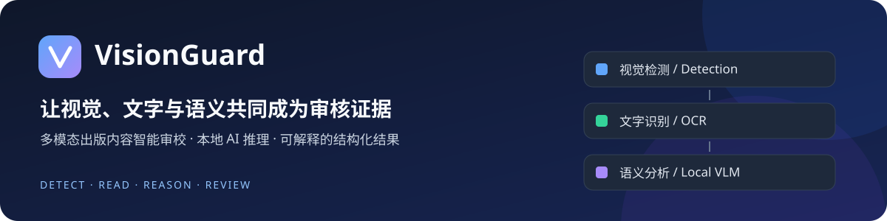
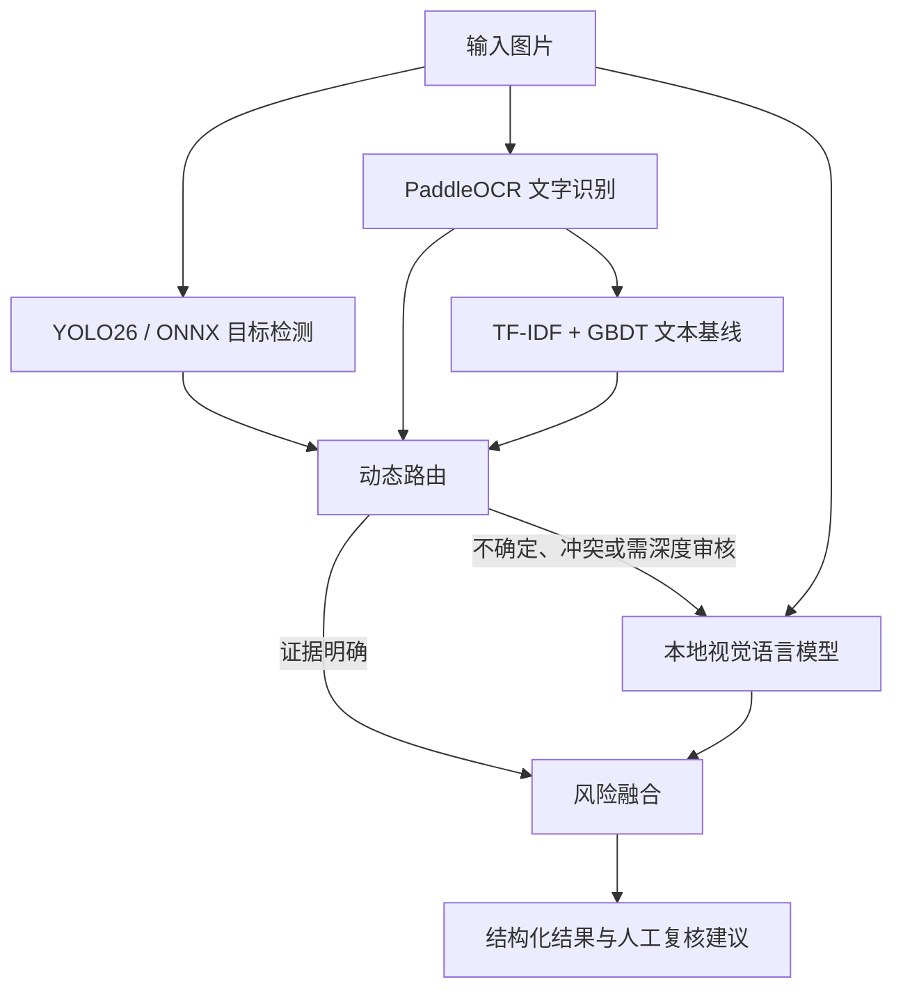

<div align="center">



# VisionGuard

**基于视觉语言模型的多模态出版内容智能审校系统**

Multimodal Publishing Content Moderation System Based on Vision-Language Models

[](https://github.com/qdjia/VisionGuard/releases/tag/v1.0.0) [](https://github.com/qdjia/VisionGuard/releases/tag/v1.0.0) [](#审核流程) [](LICENSE)

[下载安装包](https://github.com/qdjia/VisionGuard/releases/tag/v1.0.0) · [快速开始](#快速开始) · [审核流程](#审核流程) · [实验记录](#实验与评估) · [开发指南](#开发指南)

</div>

---

VisionGuard 面向出版内容审核场景，将 **目标检测、OCR、文本分类与视觉语言模型** 组织成多阶段推理链路，提供可解释的结构化审核结果。项目保留模型训练、评估、性能分析和错误分析工具，展示 AI / Computer Vision 算法研发到桌面交付的工程过程。

> **v1.0.0 已正式发布。** 安装与模型获取可联网，图片审核与 AI 推理在本机完成。当前实验主要用于验证工程链路，尚不能代表真实出版场景的审核准确率。

## 核心能力

| 能力 | 可以做什么 |
|---|---|
| **Fast Review · 快速审核** | CPU Core 执行检测、OCR、文本基线、动态路由和风险融合 |
| **Deep Review · 深度审核** | 安装可选 Advanced AI，按需调用本地 VLM 分析复杂语义与冲突证据 |
| **结构化证据** | 返回风险等级、类别、原因、证据、置信度、人工复核建议与阶段耗时 |
| **算法实验** | 检测训练与评估、OCR CER、文本基线对比和级联路由实验 |
| **性能与错误分析** | 批量推理、耗时分析、失败分类、错误案例导出与回归记录 |
| **桌面交付** | Tauri + React 桌面应用，内置 Core，支持可选 AI 组件安装与隔离运行 |

## 快速开始

### 下载与安装

1. 打开 [v1.0.0 发布页](https://github.com/qdjia/VisionGuard/releases/tag/v1.0.0)，下载 `VisionGuard-Setup-1.0.0.exe` 与 `SHA256SUMS.txt`。
2. 在 PowerShell 中计算安装包的 SHA-256，与校验和文件中的对应值比较。
3. 运行安装包，启动 VisionGuard，使用 **Fast Review** 审核图片。
4. 如需深度审核，在应用内安装 **Advanced AI**，完成后使用 **Deep Review**。

```powershell
# 在安装包所在目录执行
Get-FileHash .\VisionGuard-Setup-1.0.0.exe -Algorithm SHA256
```

最终用户无需自行安装 Python、Conda、Node.js 或 Rust。安装包包含 Core Runtime 与 Core Models；Advanced AI 在用户确认后从固定官方来源获取依赖和模型，校验后激活，安装失败不会影响 Fast Review。

> 安装包目前未使用 Authenticode 签名，Windows 可能显示 SmartScreen 提示。运行前请核对发布页提供的 SHA-256。

### 平台与组件

| 项目 | 当前版本说明 |
|---|---|
| 操作系统 | Windows x64 |
| 快速审核 | CPU 模式；最低内存与性能仍需多设备验证 |
| 深度审核 | 已在 RTX 4060 Laptop 8 GiB 上验证；不代表最低硬件要求 |
| v1.0.0 安装包 | 约 **507 MiB** |
| Core Runtime + Core Models | 文件大小合计约 **0.843 GiB**，不含 Desktop 和用户数据 |
| Advanced AI | 另行下载；完整占用随依赖、模型与缓存变化 |

### 本地推理与网络边界

- 网络用于安装、模型与组件获取、更新。
- Detector、OCR、Baseline、Router、VLM 与 Fusion 均在本机运行，不依赖云端推理 API。
- 审核图片由本地 Runtime 处理，项目不提供向云端审核服务上传图片的实现。
- “本地推理”不等于“完全离线”：不承诺隔离网部署或安装阶段断网可用。

## 审核流程

图片同时进入目标检测和 OCR；文本基线补充 OCR 证据，动态路由决定是否调用 VLM，最后由风险融合模块生成统一结果。


```mermaid
flowchart TD
    I[输入图片] --> D[YOLO26 / ONNX 目标检测]
    I --> O[PaddleOCR 文字识别]
    O --> B[TF-IDF + GBDT 文本基线]
    D --> R[动态路由]
    O --> R
    B --> R
    R -->|证据明确| F[风险融合]
    R -->|不确定、冲突或需深度审核| V[本地视觉语言模型]
    I --> V
    V --> F
    F --> J[结构化结果与人工复核建议]
```

模型通过 Adapter 接入，配置与类别定义独立于业务逻辑。OCR 保留 polygon 与 bbox，ROI 坐标映射回原图；各阶段使用稳定 Schema 并记录耗时，便于替换模型、定位错误和比较实验。

桌面端由内置 **Slim CPU Core** 与可选 **Advanced AI** 组成。VLM 使用独立进程按需加载；VLM 不可用时 Core 仍可运行，对无法确定的案例保留人工复核路径。

详细设计：[算法架构](docs/architecture.md) · [桌面架构](docs/desktop_architecture.md) · [组件化 Runtime](docs/componentized_runtime.md) · [Advanced AI 安装机制](docs/advanced_ai_online_bootstrap.md)

## 实验与评估

以下是已记录的工程实验。**样本量小，部分为合成数据，不能外推为产品质量或工业数据集性能。**

| 实验 | 已记录结果 | 解释边界 |
|---|---|---|
| YOLO 训练 | 完成训练、验证与 ONNX 导出链路 | 合成矩形数据、1 epoch，仅验证训练路径 |
| OCR | CER = 0.0 | 单张干净合成中文图片 |
| 文本 Baseline | 验证集 F1 = 0.8571 | 自编合成文本，共 36 条样本 |
| VLM 结构化输出 | 3/3 样本返回结构化结果 | 验证输出契约，不是语义质量基准 |
| 级联推理 | 3 样本实验中 VLM 调用率由 100% 降至 66.7% | 不足以证明稳定的性能收益 |
| Batch 对比 | Full 0.123、Cascaded 0.122 图片/秒 | 2 样本、单次测量，未观察到吞吐提升 |

当前实验显示 **VLM 生成是主要耗时来源**。已记录的 Batch 对比中，仅批量化 YOLO 与 Baseline 未改善整体吞吐；后续需要更大数据集和重复测量。

实验入口：[实验说明](docs/experiments.md) · [实验汇总](docs/final_experiment_summary.md) · [复现指南](docs/reproducibility.md) · [历史回归](docs/historical_regression.md)

## 开发指南

### 项目目录

```text
VisionGuard/
├── src/visionguard/   算法、推理链路、评估与模型服务
├── desktop/          Tauri + React 桌面应用
├── configs/          模型、路由与融合配置
├── scripts/          训练、评估、构建与验收工具
├── packaging/        Runtime 与组件发行配置
├── tests/            单元与集成测试
├── docs/             架构、实验、发行与验收文档
├── release-evidence/ 小型发行证据
├── artifacts/        本地实验产物（不提交）
└── models/           本地模型包（不提交）
```

### 开发环境

以下命令面向源码开发者；GPU 训练与 VLM 推理需要与设备兼容的 PyTorch 环境。

```powershell
conda activate visionguard
python -m pip install -e ".[dev]"

# 前端依赖
cd desktop
npm ci
```

<details>
<summary><strong>展开质量检查命令</strong></summary>

在仓库根目录检查 Python：

```powershell
python -m pytest -q
ruff check .
ruff format --check .
python -m compileall src scripts
```

在 `desktop/` 检查前端：

```powershell
npm test
npm run lint
npx tsc -b
npm run build
```

在 `desktop/src-tauri/` 检查 Rust：

```powershell
cargo test
cargo fmt --check
cargo check
```

</details>

<details>
<summary><strong>展开发行构建与校验命令</strong></summary>

在仓库根目录执行。严格 Stable 构建要求干净的已提交源码树，重新构建 Core 与模型，并自动校验。

```powershell
python scripts/build_release.py --version 1.0.0 --stable
python scripts/validate_release.py release/v1.0.0 --stable
```

构建脚本生成本地产物；创建标签和 GitHub Release 属于独立发布操作。

单独生成 SBOM：

```powershell
python scripts/generate_sbom.py --version 1.0.0 --output artifacts/sbom
```

</details>

工具说明：[CLI 参考](docs/cli_reference.md) · [配置说明](docs/configuration.md) · [Runtime 打包](docs/runtime_packaging.md)

## 发布状态与已知限制

`v1.0.0` 已公开为 Stable Release。Clean Core、Fresh-user GUI、Advanced AI GPU 及安装器生命周期验收已有通过记录。

- 开发验收机完成 27 张历史真实图片回放，记录为 0 confirmed / 0 potential regression；独立干净机历史复验仍未完成。
- 项目所有者仅对 `v1.0.0` 接受干净机历史复验延期和未签名发行两项风险，记为 `WAIVED_BY_OWNER`。未完成项保留原始状态，豁免不自动适用于后续版本。
- 尚缺少大规模独立标注出版数据集、可靠的分类召回率估计、风险置信度校准和重复性能基准。

发行依据：[发布门禁](docs/release_gate.md) · [发布操作](docs/release_operations.md) · [Windows 分层验收](docs/windows_acceptance.md) · [升级与回滚](docs/upgrade_rollback_acceptance.md) · [架构演进](docs/release_history.md)

## 许可证与来源

VisionGuard 自有代码使用 **AGPL-3.0-only**。第三方代码、Runtime 与模型适用各自许可证；来源与发行条件保存在对应记录中。

[项目许可证](LICENSE) · [NOTICE](NOTICE) · [第三方声明](THIRD_PARTY_NOTICES.md) · [发行许可报告](docs/release_licenses.md) · [Detector 来源](docs/detector_provenance.md)
