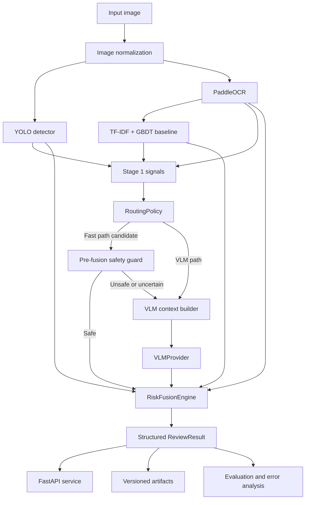
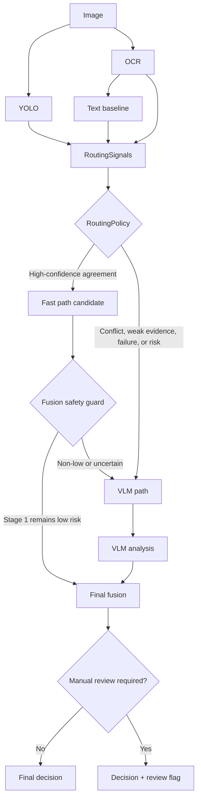
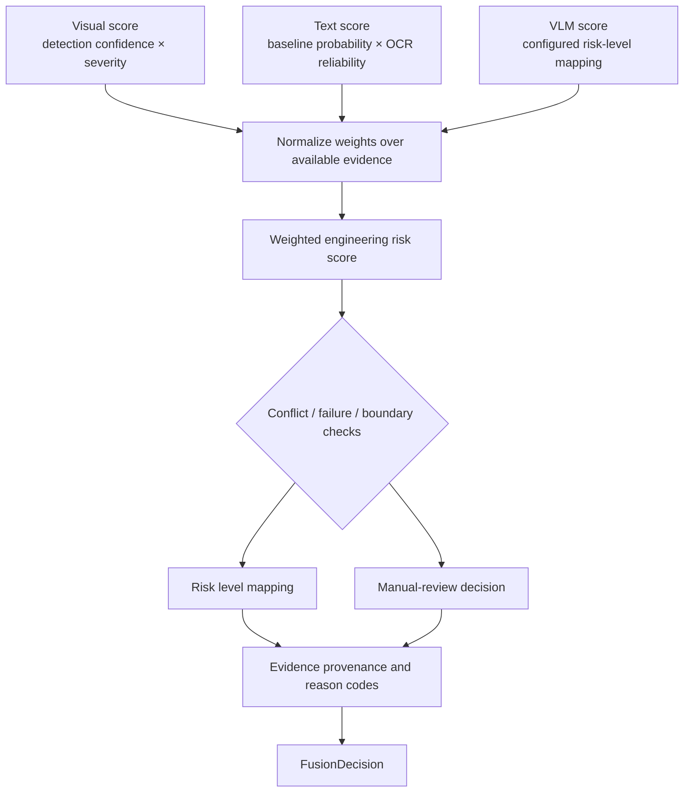
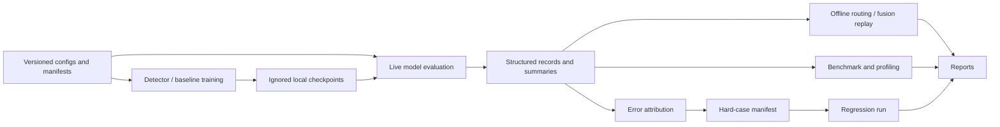

# VisionGuard Architecture

VisionGuard is a modular engineering prototype for multimodal publishing-content moderation. It
combines visual detection, OCR, a lightweight text baseline, an optional vision-language model,
and an explainable fusion layer. The system is designed for experiments and portfolio review, not
as a claim of production moderation quality.

## System architecture

YOLO and OCR operate on the same normalized image and are logically independent. The current
synchronous single-image pipeline executes them in a deterministic order for simpler failure
isolation. Batch benchmarking uses true batching only where the implementation supports it.

## Cascaded inference and routing

The VLM is deliberately optional rather than mandatory. A sample can skip it only when Stage 1
signals form a conservative low-risk consensus and the safety guard agrees. Missing evidence,
module failures, conflicts, or suspicious signals route to the VLM or manual review.

Routing and fusion have different responsibilities:

- Routing decides whether the expensive VLM should be called.
- Fusion decides the final risk level after all available evidence has been collected.
- A safety guard may override a proposed fast path before the final decision.

## Explainable fusion

`risk_score` is an engineering fusion score, **not a calibrated probability**. When a source is
unavailable, its weight is removed and the remaining weights are normalized. A failed module is
not treated as zero-risk evidence. Explicit conflicts, near-boundary decisions, and insufficient
evidence can force manual review.

## Training and experiment flow

Large models, generated artifacts, and local overrides are not tracked. Public manifests and small
synthetic fixtures are tracked so that a clean clone can inspect and regenerate the engineering
workflow. Experiment output directories reject non-empty targets to avoid silently overwriting a
previous run.

## Component ownership

| Component | Owns | Does not own |
|---|---|---|
| Detector | YOLO loading, preprocessing, detection parsing | OCR or moderation policy |
| OCR engine | OCR provider, confidence filtering, ROI coordinate remapping | Text moderation |
| Text baseline | Text normalization, TF-IDF, GBDT, thresholding | OCR execution |
| VLM provider | Prompt construction, generation, parsing, schema validation | Upstream models |
| RoutingPolicy | VLM-call decision and reason codes | Final risk decision |
| RiskFusionEngine | Final score, risk mapping, conflicts, review flag | Model execution |
| Pipeline | Orchestration, module isolation, timing, artifacts | Model construction |
| API | HTTP validation, concurrency, lifecycle, public schemas | Concrete model logic |

## Runtime lifecycle

The FastAPI application factory does not load models at import time. Lifespan startup builds one
shared Full/Cascaded pipeline pair, performs optional warmup, and marks the service ready. Requests
reuse the same model instances. The default semaphore permits one full inference at a time on the
single RTX 4060-class GPU. Shutdown stops new requests, waits for active work within a grace period,
then releases references and clears the CUDA allocator cache.

