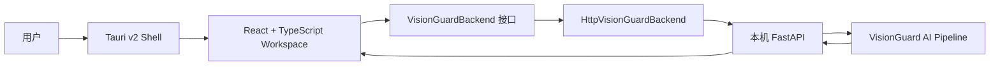

# VisionGuard Desktop 架构

## 目标与边界

Phase 14 把已有 AI Pipeline 包装成可操作的桌面工作台。桌面端负责选择与预览图片、发起审核、展示结构化证据和运行状态；它不重新实现模型逻辑，也不读取内部 artifact。当前是开发预览，不包含安装器、Python Sidecar 打包、自动更新、模型下载或代码签名。

## 当前结构



- Tauri Shell：提供原生窗口、文件选择器和系统拖放事件；能力清单按最小权限配置。
- React Workspace：使用判别联合类型状态机管理 `idle → image_selected → submitting → analyzing → completed/partial/failed`，避免互相矛盾的布尔状态。
- Backend Client：集中实现 health、meta、review 和错误映射。React 组件不直接访问 URL，也不直接调用 `fetch`。
- FastAPI：继续承担模型生命周期、输入二次校验、并发保护和统一响应契约。

## UI 工作区

主界面是一张连续工作台，而不是传统后台：

1. 初始区提供原生文件选择和拖放入口；
2. 选择后只显示文件名、尺寸和大小，不显示绝对路径；
3. 快速模式映射到 `pipeline_mode=cascaded`，深度模式映射到 `pipeline_mode=full`；
4. 分析时显示真实经过时间，不伪造阶段百分比；
5. 完成后用总览、目标检测、文字识别、AI 审核、技术详情五个视图复用同一份结果，不重复请求；
6. `partial` 是合法结果并显示醒目的人工复核提示；
7. OCR 与模型文本由 React 普通文本节点渲染，不允许 `dangerouslySetInnerHTML`。

## API 契约扩展

桌面端只依赖 `/v1/review?include_details=true` 的公开响应。Phase 14 在原有 `details` 中增量加入图片尺寸、OCR block/polygon/full text、VLM reason/evidence、融合分数/权重/reason codes/evidence。既有字段和端点保持不变，因此旧调用方继续兼容。

## 文件访问与最小权限

`src-tauri/capabilities/default.json` 只授权：

- 默认窗口能力；
- 打开原生文件对话框；
- 读取用户明确选择或拖入的文件；
- 访问 `http://127.0.0.1:*` 的本机 HTTP 服务。

当前没有 shell、Sidecar、文件写入、更新器或广泛网络权限。前端校验扩展名、MIME、大小和解码结果，后端仍独立执行安全校验。

## 可替换传输层

```ts
interface VisionGuardBackend {
  health(signal?: AbortSignal): Promise<BackendHealth>;
  meta(signal?: AbortSignal): Promise<MetaResponse>;
  review(input: ReviewInput, signal?: AbortSignal): Promise<ReviewResponse>;
}
```

当前由 `HttpVisionGuardBackend` 实现，开发地址来自 `VITE_VISIONGUARD_API_URL`，默认值只存在于 client 工厂内部，普通 UI 不显示地址。Phase 15 可在 Tauri 启动 Sidecar 后选择空闲回环端口，再把运行时 endpoint 注入同一工厂；UI、状态机和结果组件无需修改。若以后改用 Tauri IPC，也可新增实现并保持接口不变。

## Phase 15 Sidecar 生命周期预留

建议后续流程：

```text
Tauri 启动
  → 校验 Runtime/模型清单
  → 启动 PyInstaller 或 Nuitka 产物
  → Sidecar 选择空闲回环端口并返回握手信息
  → 注入 Backend Client
  → readiness 成功后开放 Analyze
  → App 退出时温和终止 Sidecar
```

Sidecar 必须绑定回环地址、使用一次性握手信息、限制允许的来源，并把日志写入应用数据目录。Phase 14 没有提前开放 `shell:*` 权限。

## 版本与更新边界

下列版本概念保持分离：

| 版本 | 负责内容 | 未来更新通道 |
|---|---|---|
| App Version | Tauri Shell 与前端 | 签名的 Tauri Updater |
| Runtime Version | Python 可执行环境 | 安装器或独立 Runtime 包 |
| Model Bundle Version | YOLO/OCR/Baseline/VLM 权重集合 | 独立模型清单与校验下载 |
| Pipeline Version | 编排与输出语义 | Runtime 元数据 |
| Routing/Fusion/Prompt Version | 策略和提示词 | Runtime/策略包元数据 |

模型文件不与 App Updater 强绑定。未来模型管理器应支持 manifest、哈希校验、断点续传、可用空间检查、原子切换和回滚；首次运行流程可扩展为 Runtime Check → Model Check → Download → Ready。本阶段只消费 readiness 和 meta，不下载任何内容。

## 开发运行

先启动已有 FastAPI：

```powershell
python scripts/run_api.py --config configs/api.local.yaml
```

再启动原生开发窗口：

```powershell
cd desktop
npm install
npm run tauri:dev
```

仅开发环境需要切换端点时，复制 `.env.example` 为 `.env.local`。不要把本机配置提交到 Git。

## 当前限制

- API 尚无 SSE/WebSocket 阶段事件，UI 只显示真实耗时和总体分析状态；
- HTTP Runtime 需由开发者单独启动，尚未由桌面应用管理；
- 尚无安装器、签名、更新器、模型管理器和首次运行向导；
- 无历史数据库、账号、遥测、报告导出或 GPU 硬取消；
- 视觉覆盖层基于稳定的 API 坐标，不解析内部 pipeline artifact。
