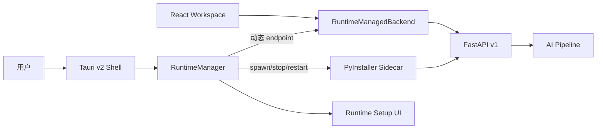

# VisionGuard Desktop 架构

## 目标与边界

Phase 15 将 Phase 14 的桌面工作台升级为 local-first 应用：Tauri 负责启动和回收独立 Python AI Runtime，React 只消费稳定的 `VisionGuardBackend` 接口。用户不需要了解 Python、Conda、Uvicorn、端口或模型路径。本阶段不包含安装器、签名、自动更新、模型下载或 GitHub Release，这些属于 Phase 16。

## 运行结构



- `RuntimeManager`：校验模型 manifest、生成用户态配置、启动 Sidecar、轮询 live/ready、检查 API major version、检测崩溃并负责 graceful stop/force kill。
- Python Runtime：只绑定 `127.0.0.1`，在预绑定的动态端口上运行 Uvicorn；模型只随服务容器初始化一次。
- `RuntimeManagedBackend`：每次请求从 Rust command 获取当前 endpoint，不把动态端口编译进 JavaScript bundle。
- React Runtime Setup：显示真实状态和已耗时，不伪造进度；失败时提供重启和去敏诊断。
- External 模式：保留独立 FastAPI 开发工作流，便于逐层调试，不改变主 UI。

## 启动状态机

```text
stopped → starting → validating_models → launching
        → waiting_for_live → waiting_for_ready → ready

任一阶段异常 → failed → 用户触发 restart → starting
应用退出     → stopping → stopped
```

Sidecar 首先写入原子状态文件，发布 PID、动态 endpoint、版本、模型校验和去敏诊断；Rust 再访问 `/health/live` 与 `/health/ready`。模型后台加载失败时，Runtime 同时更新状态文件，避免桌面端只能等待超时。

## 动态端口与资源定位

Python 先将 socket 绑定到 `127.0.0.1:0`，由操作系统选择端口，然后把同一个 socket 交给 Uvicorn，消除“先探测、后占用”的端口竞争。endpoint 只存在于当前 Runtime 状态中。

Runtime 不依赖启动目录：PyInstaller 资源从 `_MEIPASS/resources` 定位；模型目录和用户数据目录由绝对路径配置传入。日志、缓存、临时配置和可选 artifacts 写入 Tauri 的应用本地数据目录，模型目录只读。

## 模型包与离线优先

模型和 Runtime 独立版本化。`models-v1/manifest.json` 记录 detector、三个 OCR 模型、baseline 和 VLM 的相对路径、字节数与 SHA-256。启动使用快速校验（存在性与大小），发布验收可使用完整哈希校验。

运行时设置 Hugging Face 离线环境，VLM 使用 `local_files_only`，PaddleOCR 接收显式本地目录，YOLO 接收 manifest 中的本地权重。因此首次 Analyze 不会隐式联网下载模型。

| 层 | 当前版本来源 | 兼容边界 |
|---|---|---|
| App | `tauri.conf.json` | Tauri Shell 与前端 |
| Runtime | `visionguard.runtime.RUNTIME_VERSION` | Python 依赖和服务实现 |
| API | `/v1/meta.api_version` | Desktop 当前要求 `v1` |
| Models | `manifest.json.bundle_version` | manifest 声明 Runtime 版本范围 |
| Pipeline | API metadata | 编排与输出语义 |

## 生命周期与异常处理

正常关闭时，Rust 以仅保存在内存中的一次性 control token 调用隐藏的 shutdown route；超过 5 秒则强制终止子进程。Sidecar event stream 监视非预期退出并映射为 `RUNTIME_EXITED`。启动失败自动重试一次；模型缺失或损坏不会盲目重试。

错误码包括 `RUNTIME_START_FAILED`、`RUNTIME_EXITED`、`RUNTIME_NOT_READY`、`MODEL_BUNDLE_MISSING`、`MODEL_BUNDLE_INVALID`、`MODEL_VALIDATION_FAILED` 和 `RUNTIME_VERSION_MISMATCH`。UI 不展示 Python traceback 或 control token。

## 权限与安全边界

Tauri capability 只允许主窗口读取用户选择的文件、访问 `127.0.0.1:*`，以及使用固定参数形状启动 `visionguard-runtime` Sidecar。Runtime 不监听局域网地址。当前 control token 只保护 shutdown 控制面；审核 API 仍是 loopback HTTP，同机其他进程理论上可以访问，这是进入正式发行前需要继续收紧的边界。

## 开发运行

Sidecar 模式：

```powershell
python scripts/build_model_bundle.py --hardlink --force
python scripts/build_runtime.py
cd desktop
npm run tauri:dev
```

External 模式：

```powershell
python scripts/run_api.py --config configs/api.local.yaml
cd desktop
$env:VISIONGUARD_BACKEND_MODE="external"
$env:VISIONGUARD_API_URL="http://127.0.0.1:8000"
npm run tauri:dev
```

详细打包和验证命令见 [Runtime 打包说明](runtime_packaging.md)。

## Phase 16 准备情况与当前限制

Runtime、模型、App 已拆分版本和目录，sidecar target-triple 命名及 Tauri resource 复制已就绪，可作为安装器输入。Phase 16 仍需完成磁盘空间预检、模型安装/修复流程、签名、安装/卸载、快捷方式和发布渠道。

- 当前完整 Runtime 受 CUDA PyTorch 影响体积较大；正式发行可评估精简 CUDA runtime 或 CPU/GPU 双包。
- Readiness 等待上限为 120 秒；低配机器可能需要配置化。
- 尚无模型下载 UI、原子模型升级或回滚。
- 尚无 SSE/WebSocket 逐阶段进度与 GPU 级硬取消。
- 本阶段不提供 Windows Installer。
